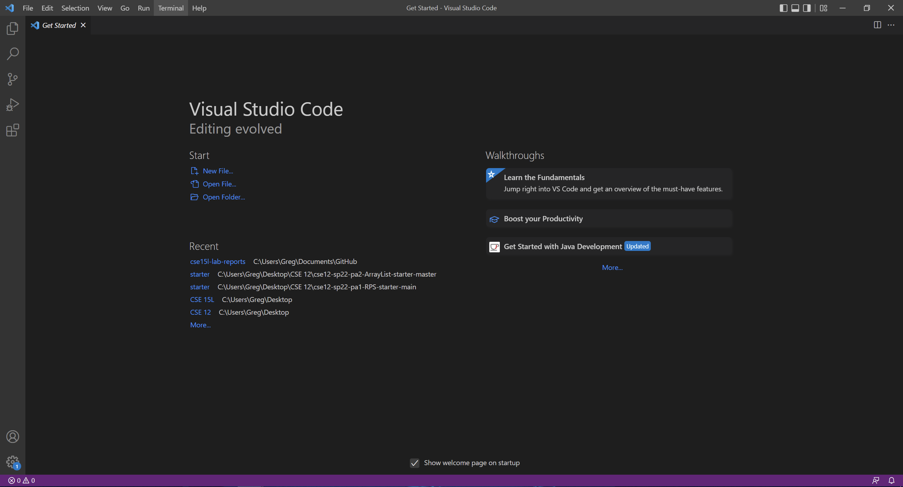
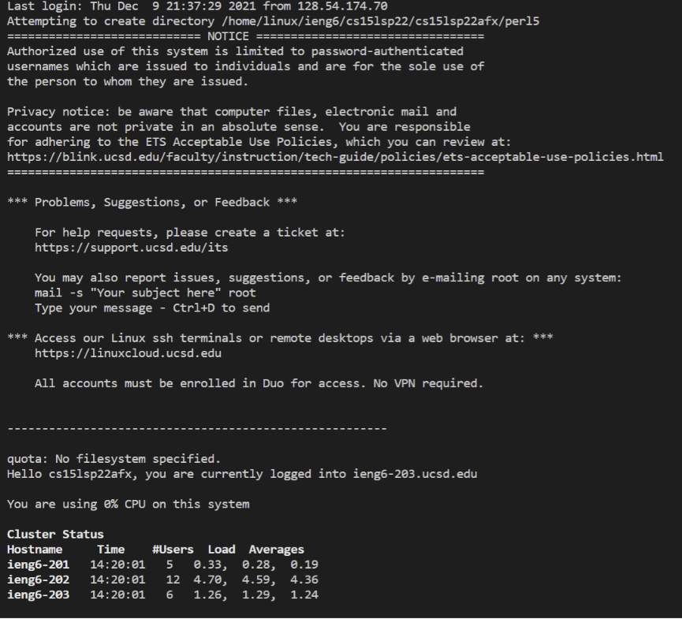
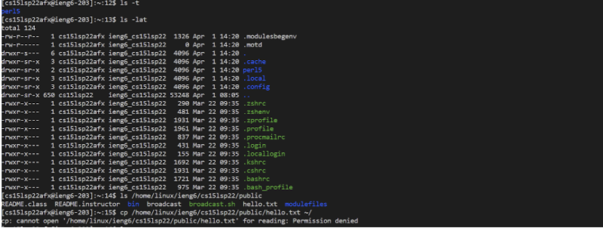
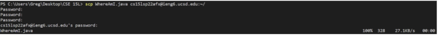
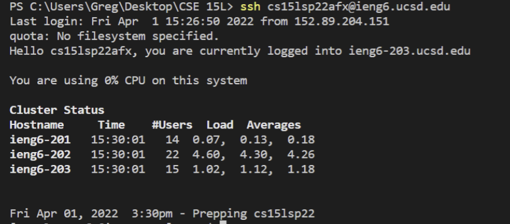
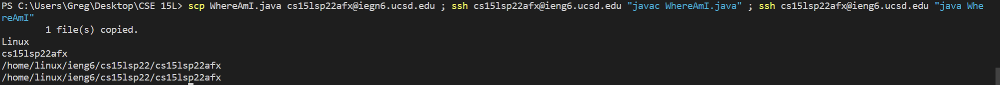

# How to log into a course-specific account on **ieng6**

# 1. Installing VSCode
Go to the [Visual Studio Code Website](https://code.visualstudio.com/) and follow the instructions to download and install VScode to your computer.

After it is installed you should see something that looks similar to this.


# 2. Remotely Connecting
Go to this [website](https://docs.microsoft.com/en-us/windows-server/administration/openssh/openssh_install_firstuse) and follow the instrutions on how to install OpenSSH on your computer.

Then find your course specific account [here](https://sdacs.ucsd.edu/~icc/index.php).

Now we will try to connect to the remote computer. The first thing we need to do is to open the terminal in VSCode(ctrl + ~ or Terminal then New Terminal) and enter the following command

`$ ssh cs15lsp22zz@ieng6.ucsd.edu` replacing zz with the letters in your course specific account.

Since this is the first time accessing the remote computer you will get the following message
```
The authenticity of host 'ieng6.ucsd.edu (128.54.70.227)' can't be established.
RSA key fingerprint is SHA256:ksruYwhnYH+sySHnHAtLUHngrPEyZTDl/1x99wUQcec.
Are you sure you want to continue connecting (yes/no/[fingerprint])?
```
Simply enter yes.

Next you will be prompted to enter your password. After you enter your password and you login, it should look something like this.



# 3. Trying some commands
Enter some of the following commands:
* `cd ~`
* `cd`
* `ls -lat`
* `ls-a`
* `ls <directory>` where directory is `/home/linux/ieng6/cs15lsp22/cs15lsp22abc` where abc is someone else's username.
* `cp /home/linux/ieng6/cs15lsp22/public/hello.txt ~/`
* `cat /home/linux/ieng6/cs15lsp22/public/hello.txt`

After trying out some of the commands your terminal may look something like this:


# 4. Moving files with `scp`
Now we will try to copy a file from your computer to a remote computer. This is done with the `scp` command and it is always run from your client on your computer, not when you are have logged in to the remote desktop. 

Create a file on your computer and put some code in it.

Now, in the terminal from the directory the file is in, run the following command:

`scp xx cs15lsp22zz@ieng6.ucsd.edu:~/` replacing xx with the file name and zz with your username.

You will then be asked to enter your password again and you should see something like this in the terminal:

Except WhereAmI.java will be whatever your file is called.

# 5. SSH Keys
Now we will use `ssh-keygen` to create a **public key** and a **private key** so that we can login to the server without needing to enter a password.

In order to do this we will enter the following commands on your computer:

```
$ ssh-keygen
Generating public/private rsa key pair.
Enter file in which to save the key (/Users/<user-name>/.ssh/id_rsa): /Users/<user-name>/.ssh/id_rsa
Enter passphrase (empty for no passphrase):
Enter same passphrase again: 
Your identification has been saved in /Users/<user-name>/.ssh/id_rsa.
Your public key has been saved in /Users/<user-name>/.ssh/id_rsa.pub.
The key fingerprint is:
SHA256:jZaZH6fI8E2I1D35hnvGeBePQ4ELOf2Ge+G0XknoXp0 <user-name>@<system>.local
The key's randomart image is:
+---[RSA 3072]----+
|                 |
|       . . + .   |
|      . . B o .  |
|     . . B * +.. |
|      o S = *.B. |
|       = = O.*.*+|
|        + * *.BE+|
|           +.+.o |
|             ..  |
+----[SHA256]-----+
```
Make sure to replace user-name with your username and that you don't type anything when asked for the passphrase and just press enter and the key's randomart image will be different.

Now we need to copy the **public key** to the .ssh directory of your user account on the server.

1. log into the server with `$ ssh cs15lsp22zz@ieng6.ucsd.edu` again replacing zz with your username. 
2. Then entering the command `$ mkdir .ssh` which creates a new directory called .ssh
3. logout with ctrl+d or typing `quit`
4. Now back on our client `$ scp /Users/<user-name>/.ssh/id_rsa.pub cs15lsp22zz@ieng6.ucsd.edu:~/.ssh/authorized_keys` again replacing user-name with your username and zz with your username.

Now if we were to try and login to the server again with `ssh` or try to use `scp` we would no longer be asked to enter a password instead, it should look something like this:

Notice that I was no longer prompted to enter my password.

# 6. Optimizing Remote Running
You can run a ssh command by adding the command in speach marks at the end of an ssh command for example: `$ ssh cs15lsp22zz@ieng6.ucsd.edu "pwd"`. This would login to the server, print the current working directory and exit.

Also you can run multiple commands on the same line by using semicolons for example: 

`scp WhereAmI.java cs15lsp22afx@iegn6.ucsd.edu; ssh cs15lsp22afx@ieng6.ucsd.edu "javac WhereAmI.java"; ssh cs15lsp22afx@ieng6.ucsd.edu "java WhereAmI"`. This would copy the file WhereAmI.java to the server, compile it then run it.
I would get the following result:


You can also use the up arrow key to get previously run commands. So by combining these things, you can run multiple commands efficiently.