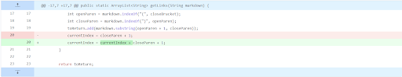
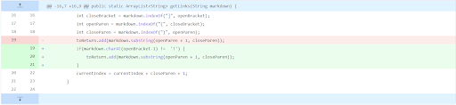
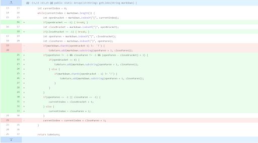

# Bug Fixing

# First Bug
The first bug that my groupd tried to fixed was that if there was a blank line at the end of the markdown file, it caused an infinite loop. Resulting in the following error:
```
Exception in thread "main" java.lang.OutOfMemoryError: Java heap space
        at java.base/java.util.Arrays.copyOf(Arrays.java:3512)
        at java.base/java.util.Arrays.copyOf(Arrays.java:3481)
        at java.base/java.util.ArrayList.grow(ArrayList.java:237)
        at java.base/java.util.ArrayList.grow(ArrayList.java:244)
        at java.base/java.util.ArrayList.add(ArrayList.java:454)
        at java.base/java.util.ArrayList.add(ArrayList.java:467)
        at MarkdownParse.getLinks(MarkdownParse.java:19)
        at MarkdownParse.main(MarkdownParse.java:30)
```
This is the link to the [test file](https://github.com/Gregory-Chan/markdown-parser/blob/main/test2.md).

We fixed this by changing how the variable currentIndex would update as shown below.


Because currentIndex wasn't updating if there was an empty line, the program would be stuck in a infinite while loop which resulted in the out of memory error that we got.

# Second Bug
The second bug we fixed was that the link or file name for images would be also be counted as links. 

The following [test file](https://github.com/Gregory-Chan/markdown-parser/blob/main/Test3.md) resulted in this output:
```
[image.png, some-thing.html]
```
image.png should not be inclued in the list since it is the file name of an image. We managed to fix this by adding an if statement that would check the character before the open bracket and see if it was an '!' and if it was, the link should be skipped. Shown in the image below.


The issue with our program was that it could not distinguish between an image and a website which is why it included image links in the final output.

# Third Bug
The third bug we encountered was that if the markdown file had a set of brackets and there were no brackets following it there would be an index out of exception.

The following [test file](https://github.com/Gregory-Chan/markdown-parser/blob/main/test-file3.md) resulted in this output:
```
Exception in thread "main" java.lang.StringIndexOutOfBoundsException: begin 0, end -1, length 31
        at java.base/java.lang.String.checkBoundsBeginEnd(String.java:4601)
        at java.base/java.lang.String.substring(String.java:2704)
        at MarkdownParse.getLinks(MarkdownParse.java:20)
        at MarkdownParse.main(MarkdownParse.java:32)
```

We fixed this by adding break statements in the while loop as while as changing the if statement to check if the variable openParen was -1 and if it was, we would set currentIndex to closeBracket + 1 instead of closeParen + 1. Shown in the image below.


The issue was that because openParen was -1 when searching for closeParen, it would search from index 0 to -1 and since -1 isn't a valid index, there would be an IndexOutofBoundsException.