# Lab Report 3

# Streamlining ssh Configuration
First I had to make a config file in the .ssh folder and add the following lines to it.
```
Host ieng6
    HostName ieng6.ucsd.edu
    User cs15lsp22afx
    IdentifyFile ~/.ssh/id_rsa
```
So it become this:

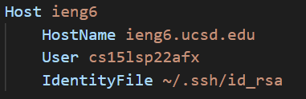

So now whenever I enter the command `ssh ieng6` I will connect to the remote server. As shown below.

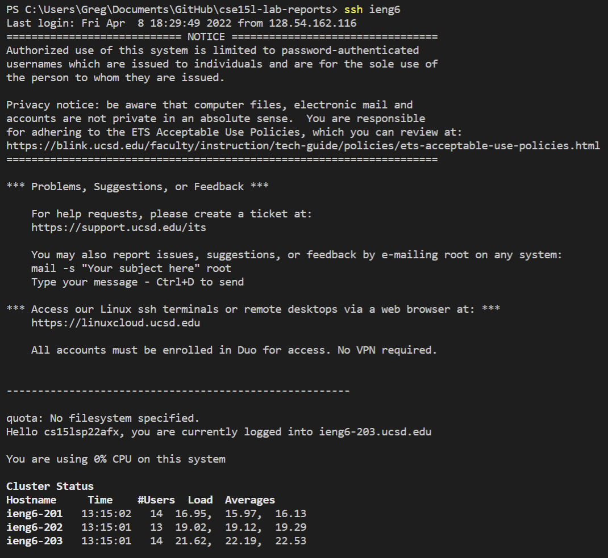

I can also use the alias ieng6 when copying a file as shown below.

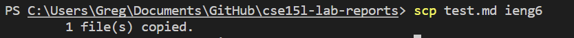

# Setup Github Access from ieng6
I was able to create a public and private rsa key pair and it is stored my user account as shown in the image below.

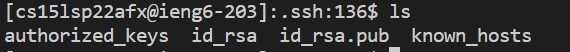

I added the public key to GitHub.

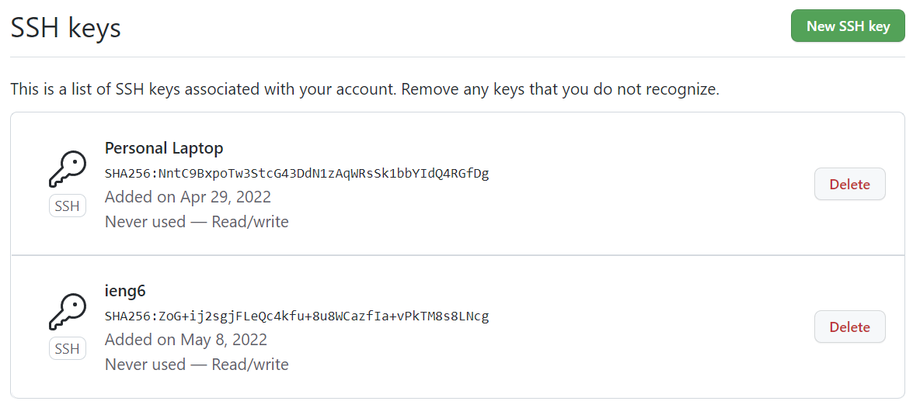

Following this I was able to commit and push changes to github from the remote desktop as shown in the images below.

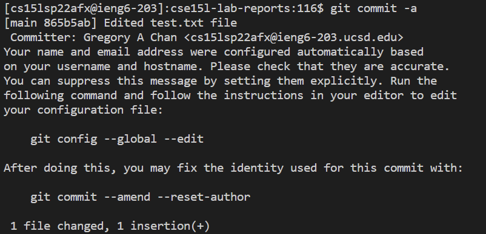

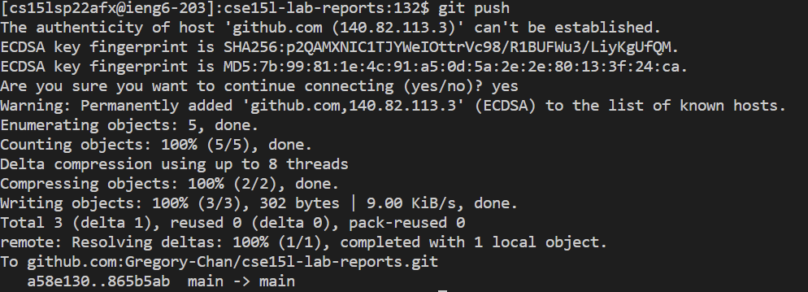

Here is a [link](https://github.com/Gregory-Chan/cse15l-lab-reports/commit/865b5ab78b6fc3ef39aa3af96ca464ba9011431f) to the commit.

# Copy whole directories with `scp -r`
I was able to copy the whole markdown-parser directory to the remote desktop as shown below.
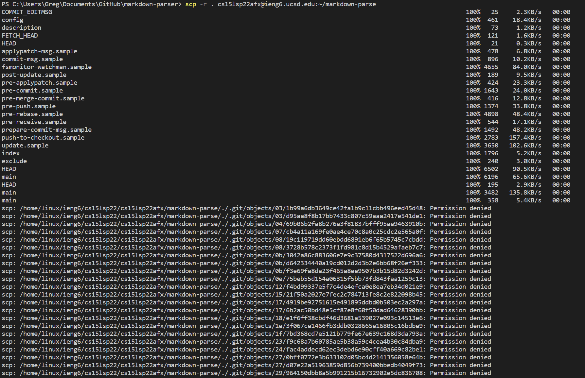

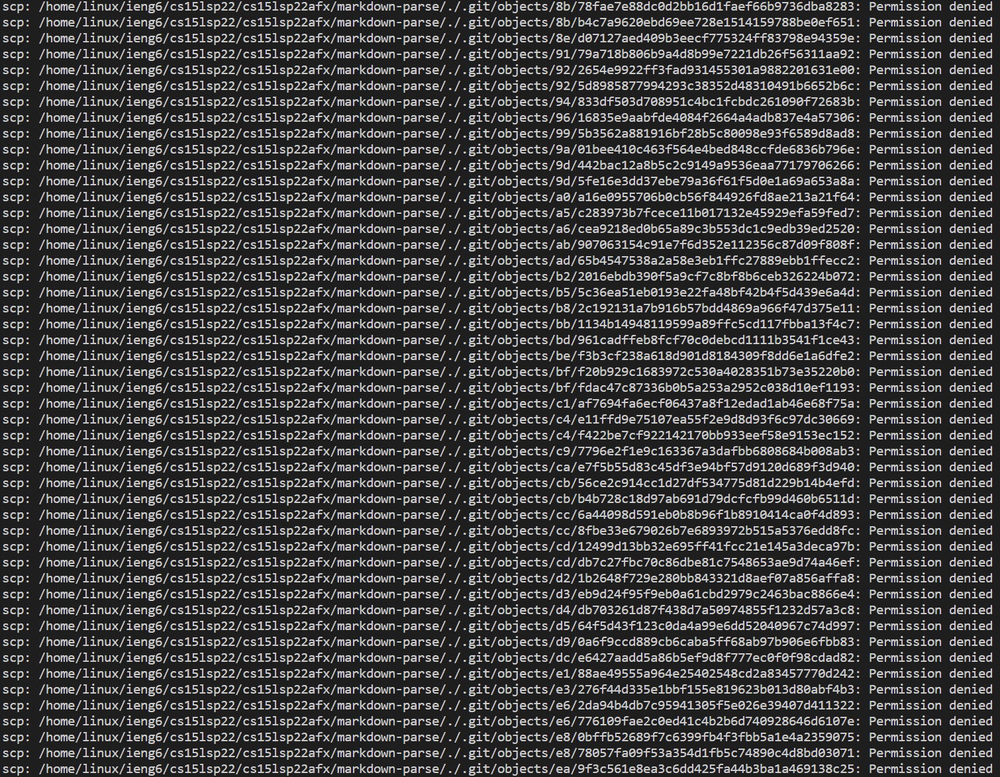
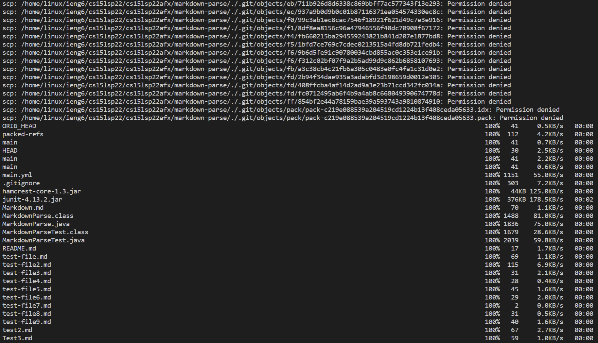

I was then able to connect to the remote desktop and compile and run the test file as shown below.

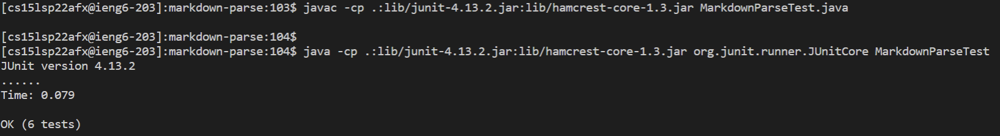

I was also able to copy, compile and run the testfile with 1 command line input which was `scp -r . cs15lsp22afx@ieng6.ucsd.edu:~/markdown-parse; ssh ieng6 "cd markdown-parse; /software/CSE/oracle-java-17/jdk-17.0.1/bin/javac -cp .:lib/junit-4.13.2.jar:lib/hamcrest-core-1.3.jar MarkdownParseTest.java; /software/CSE/oracle-java-17/jdk-17.0.1/bin/java -cp .:lib/junit-4.13.2.jar:lib/hamcrest-core-1.3.jar org.junit.runner.JUnitCore MarkdownParseTest"`. The images below show the result of running this command.

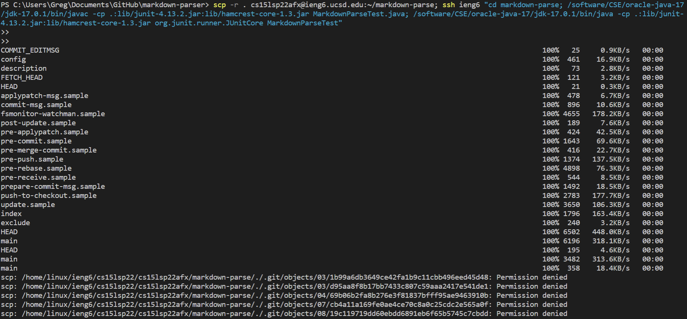
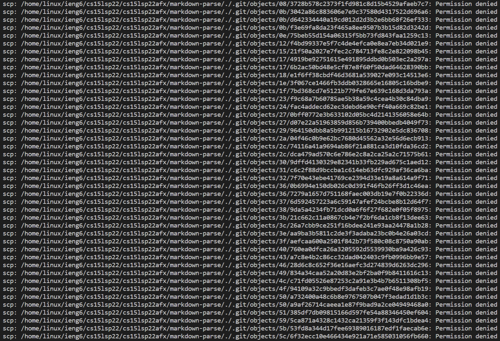
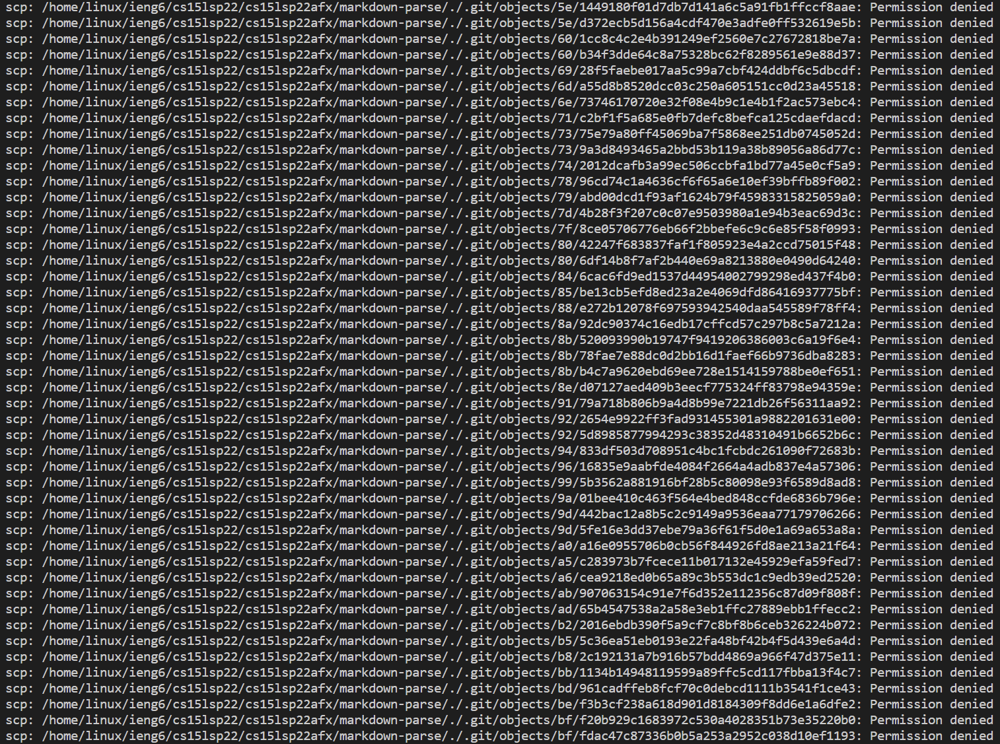
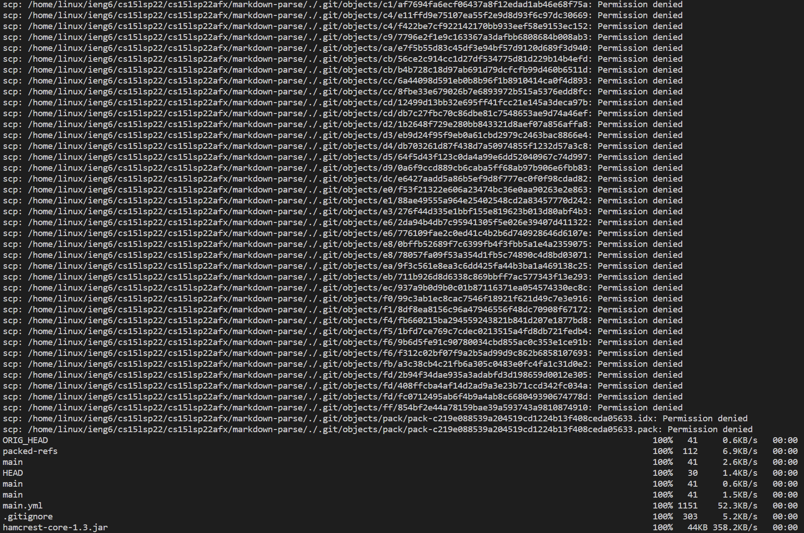
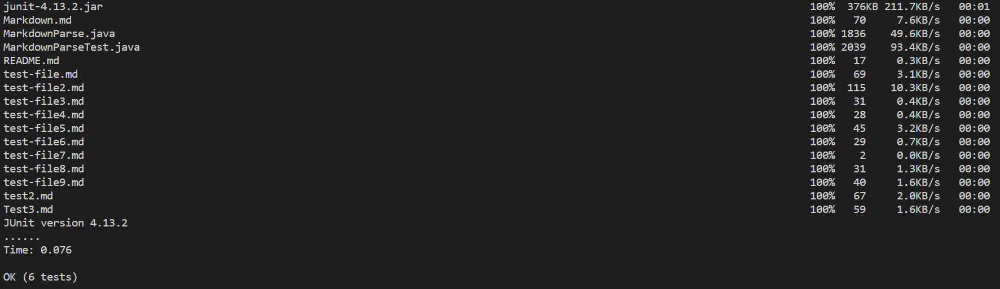
